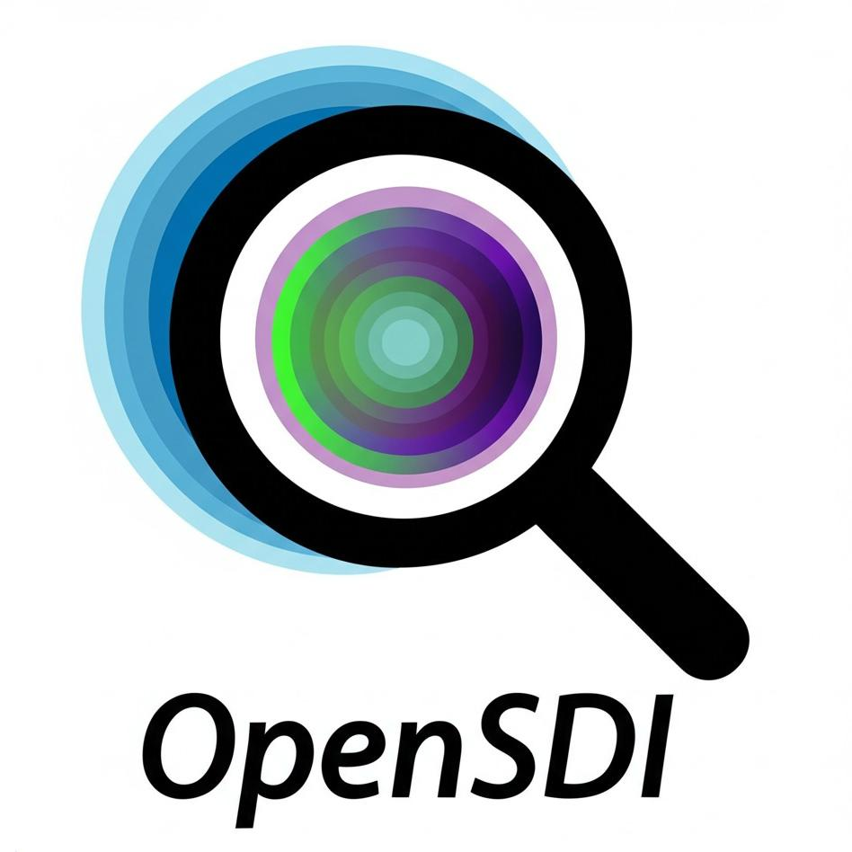
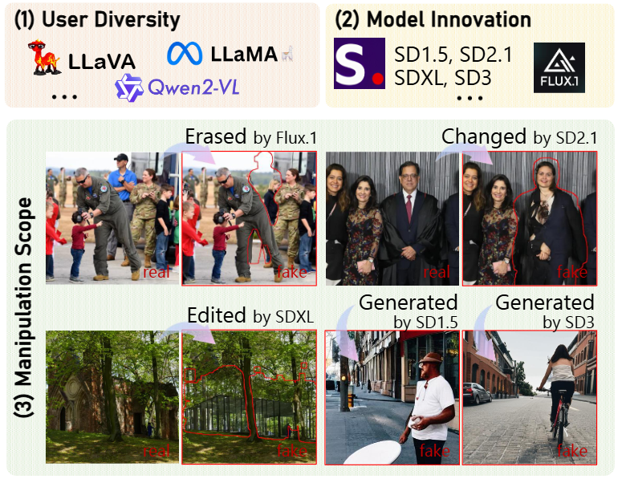
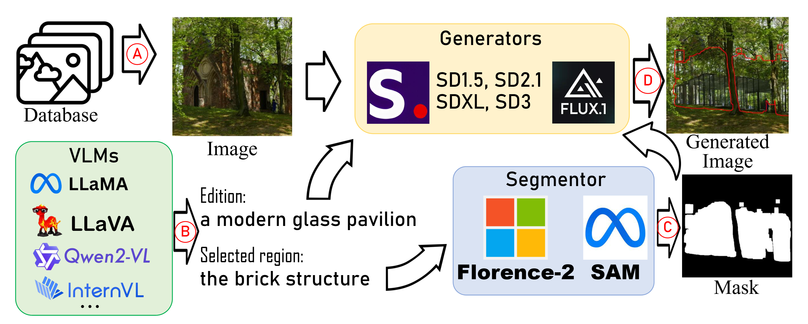
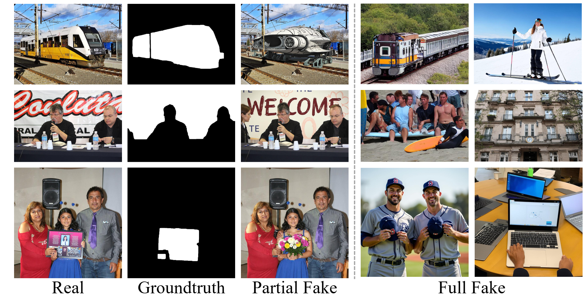
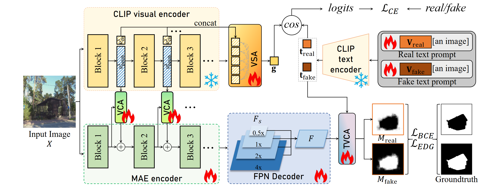

<div align="center">
    
</div>

# OpenSDI: Spotting Diffusion-Generated Images in the Open World
<div align="center">

[](https://huggingface.co/datasets/nebula/OpenSDI_train) [](https://huggingface.co/datasets/nebula/OpenSDI_train) [](https://arxiv.org/abs/2503.19653) [](https://iamwangyabin.github.io/OpenSDI/)

</div>

## News
 - [2025/3/10] We release dataset and code!


## Introduce OpenSDI challenge

As text-to-image (T2I) diffusion models rapidly advance, distinguishing between real and AI-generated images becomes increasingly challenging.  This repository introduces **OpenSDID (Open-world Spotting of Diffusion Images Dataset)**, a novel benchmark designed to address the **OpenSDI challenge**:  spotting diffusion-generated images in realistic, open-world scenarios.

**OpenSDID Dataset Highlights:**

* **User Diversity:**  Simulates the wide range of user intentions and creative styles. We use diverse text prompts generated by VLMs to capture varied real-world editing scenarios.
* **Model Innovation:**  Accounts for the rapid evolution of diffusion models. OpenSDID includes images from multiple state-of-the-art diffusion models (SD1.5, SD2.1, SDXL, SD3, Flux.1) released after 2023.
* **Manipulation Scope:** Covers the full spectrum of diffusion-based manipulation, from global image synthesis to precise local edits, object insertions, and background changes.


<br>

<div align="center">

| Model | Training Set | | Test Set | | Total |
| --- | --- | --- | --- | --- | --- |
| | Real | Fake | Real | Fake | Images |
| SD1.5 | 100K | 100K | 10K | 10K | 220K |
| SD2.1 | - | - | 10K | 10K | 20K |
| SDXL | - | - | 10K | 10K | 20K |
| SD3 | - | - | 10K | 10K | 20K |
| Flux.1 | - | - | 10K | 10K | 20K |
| Total | 100K | 100K | 50K | 50K | 300K |
</div>
<p align="center">Dataset Overview. </p>

<!-- 
**How we created OpenSDID?**

<br>
 -->

<!-- **Samples** -->


<p align="center">Samples. </p>

**Download:**

We have packaged the dataset into Hugging Face datasets for convenient distribution in the following link:
[OpenSDI Training Dataset](https://huggingface.co/datasets/nebula/OpenSDI_train)
[OpenSDI Testing Dataset](https://huggingface.co/datasets/nebula/OpenSDI_test)

*We distribute this dataset under the [CC BY-SA 4.0 license](https://creativecommons.org/licenses/by-sa/4.0/).
Real images come from [megalith-10m](https://huggingface.co/datasets/madebyollin/megalith-10m). 
This dataset is for academic use. While it has undergone ethical review by the University of Southampton, it is provided 'as is' without warranties. Users assume all risks and liabilities associated with its use; the providers accept no responsibility for any consequences arising from its use.*

The original data (indiviual image files) will be uploaded to cloud storage later.

For dataset utilization, we recommend using [IMDLBenCo](https://github.com/scu-zjz/IMDLBenCo), which offers many methods.
And you can use our hf dataset to load the data.


**Benchmark and Leaderboard: Join the OpenSDI Evaluation!**

We maintain a public leaderboard at [OpenSDI Leaderboard](https://iamwangyabin.github.io/OpenSDI/). We warmly welcome researchers to evaluate their detection and localization models using our OpenSDID dataset and submit their results to contribute to this growing benchmark.

## Quick Start with MaskCLIP
To address the OpenSDI challenge, we introduce **MaskCLIP**, a novel method based on our **Synergizing Pretrained Models (SPM) framework**. MaskCLIP effectively enhances the generalization strengths of two powerful pre-trained models at image and pixel levels:

* **CLIP (Contrastive Language-Image Pre-training):** Provides robust image-level semantic understanding, crucial for generalizable detection.
* **MAE (Masked Autoencoder):** Offers fine-grained spatial representation learning, essential for accurate forgery localization at pixel level.

<p align="center">MaskCLIP overview. </p>

### Installation
```
conda create -n opensdi python=3.12 -y
conda activate opensdi
pip install -r requirements.txt
pip install torch torchvision torchaudio 
pip install git+https://github.com/openai/CLIP.git
wget -P weights https://dl.fbaipublicfiles.com/mae/pretrain/mae_pretrain_vit_base.pth
```

### Train
```
train.sh
```

### Test
```
test.sh
```


## Citation
If you find OpenSDI useful for your research and applications, please cite using this BibTeX:

```bib
@InProceedings{wang2025opensdi,
    author={Wang, Yabin and Huang, Zhiwu and Hong, Xiaopeng},
    title={OpenSDI: Spotting Diffusion-Generated Images in the Open World},
    booktitle = {Proceedings of the IEEE/CVF Conference on Computer Vision and Pattern Recognition (CVPR)},
    year={2025}
  }
```


## References & Acknowledgements
We sincerely thank [MaPLe](https://github.com/muzairkhattak/multimodal-prompt-learning), [IML-ViT](https://github.com/SunnyHaze/IML-ViT) and [IMDLBenCo](https://github.com/scu-zjz/IMDLBenCo) for their exploration and support. 

